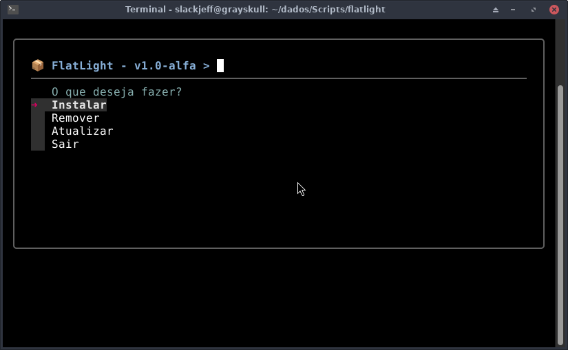
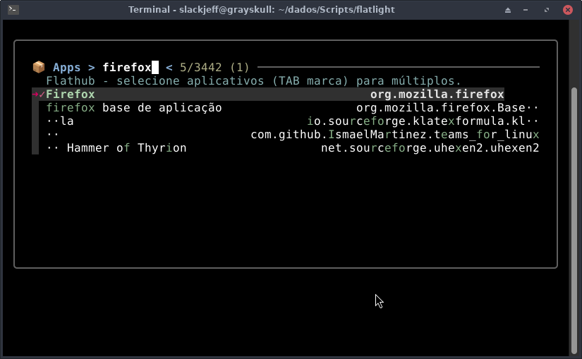

# Flatlight

Um utilitário de linha de comando rápido e interativo para gerenciar pacotes **Flatpak** utilizando **`fzf`**, focado em simplicidade, fluidez e produtividade.




---

## Sobre o Projeto

O **Flatlight** nasceu da minha necessidade de tornar o gerenciamento de aplicativos Flatpak mais ágil e intuitivo diretamente pelo terminal.
Em vez de lidar com comandos longos ou interfaces gráficas pesadas, o Flatlight combina a velocidade dos scripts Bash com uma interface de seleção em texto rico (TUI) alimentada pelo `fzf`.

Com ele, é possivel buscar, instalar e remover multiplos aplicativos de forma simultânea e integrada ao Flathub.

---

## Principais Funcionalidades

* **Interface Interativa com `fzf`:** Navegue por uma lista limpa e organizada dos aplicativos com suporte a busca em tempo real.
* **Seleção Múltipla:** Marque vários aplicativos de uma só vez usando a tecla `TAB` para processá-los em lote.
* **Alternância Inteligente (Toggle):** A mesma interface detecta automaticamente o estado do aplicativo — se ja estiver instalado, o Flatlight realiza a remocao; caso contrario, executa a instalacao.
* **Atalhos Úteis:** Comandos integrados para selecionar (`Ctrl+A`) ou desmarcar (`Ctrl+D`) todos os itens instantaneamente.
* **Leve e Eficiente:** Escrito em Bash puro, com dependências mínimas e baixo consumo de recursos.

---

## Pré-requisitos

Para que o Flatlight funcione corretamente no seu sistema, certifique-se de ter os seguintes pacotes instalados:

* **[Flatpak](https://flatpak.org/)** (com o repositorio Flathub configurado)
* **[fzf](https://github.com/junegunn/fzf)** (Fuzzy finder para a interface interativa)

---

## Instalação

1. Clone o repositório ou baixe o script principal para o seu ambiente:

   ```bash
   git clone https://github.com/slackjeff/FlatLight.git
   cd flatlight
   ```

2. Torne o script executável

```
chmod +x flatlight
```

## Roadmap do Projeto

Este documento descreve os objetivos futuros e o planejamento de evolução

## [Planejado]

* [ ] Melhorar o formato de cache que hoje é simples
* [ ] Documentação para man (página de manual do sistema)
* [-] (INICIADO) Internacionalização com gettext
* [ ] Validação automática de dependências (`fzf` e `flatpak` instalados)
